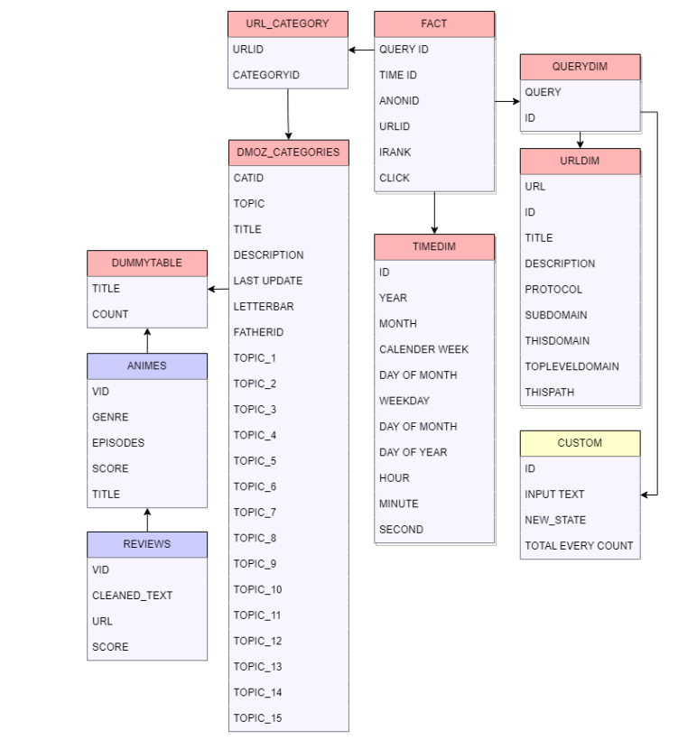

# User-search-behaviour-analysis-on-anime

In the course of this project, we examined anime-related search queries originating from diverse users, taking into account their distinctive search patterns, visited websites, geographic trends, and other relevant factors. Our primary objective was to discern the factors influencing these searches and to observe how these influences evolved over time. Despite the inherent limitation of our dataset, we managed to extract valuable insights within a condensed timeframe. To refine our understanding, we narrowed our focus exclusively to the United States.

For this project we utilized Exasol to establish a connection with the database image (Installation and setup guide below). Employing SQL queries, we mined the data for answers and leveraged Python for data cleaning purposes. Furthermore, our utilization of Python extended to interfacing with external data sources, allowing us to extract nuanced insights and formulate substantiated conclusions. This comprehensive approach, combining database querying and programming, enabled us to derive a comprehensive understanding of anime-related search behaviors, especially within the context of the U.S. region.

# About the Data

Presented here is a snapshot of AOL leaked data (2006) encompassing over 36 million query logs, predominantly originating from U.S. citizens, and the corresponding clicked results spanning the period from March to June 2006. This dataset was culled from the AOL search engine during a period when Google search technology was in use. 

**Context**

The dataset contains numerous tables, but for our project, we will focus mainly on the following tables: `DMOZ_CATEGORIES`, `FACTS`, `QUERYDIM`, `TIMEDIM`, `URL_CATEGORY`, and `URLDIM`.

Each of these tables has various columns. Below are the specific columns from these tables that we'll be using for our project:

`Topic`: This column provides the full name of the category and indicates its placement.

`Title`: Refers to the name of the category to which a query belongs.

`Topic 1 - 15`: These columns list sub-topics corresponding to the full topic mentioned.

`Catid`: This is a unique identifier for each category.

`Query`: The specific query made by the user.

`Queryid`: Represents the ID of the query.

`Click`: This is a boolean value that indicates whether a user clicked on the provided link or URL.

`URL`: This column provides the actual URL that corresponds to the executed query.

_Note_: I haven't detailed every ID column that can be used for joining tables to avoid potential confusion. The column names are mostly self-explanatory.

**External Dataset**

To gather deeper insights from our data, we link it with a database available on Kaggle.
The dataset contains information about reviews from users for different animes, with text review and scores.

Link to the file: https://www.kaggle.com/datasets/marlesson/myanimelist-dataset-animes-profiles-reviews?select=reviews.csv

**Final Schema**

# Technologies Used

`Database`: Exasol (DB Image)

`Connection to Database`: DataGrip, Virtual Machine (Oracle)

`Programming Languages and Tools`: SQL, Python, Jupyter Notebook

`Visualization`: PowerBI

# Analysis

## [Task 1: Analysing most visited websites](./Task%201:%20Analysing%20most%20visited%20websites/)

In this task, the objective is to analyze the most visited websites that users frequent both in an overall context and on a monthly basis. Notably, we found that `cartoonsanime.com` emerged as the most visited website in the aggregate data. However, upon visualizing the monthly metrics, it became evident that the ranking and user engagement varied across different months.

## [Task 2: Genre preference across region](./Task%202:%20Genre%20preference%20across%20region/)

In this task, our objective is to discern the popularity of specific anime genres and titles across various states in the U.S. By examining this geographical dimension, we aim to uncover trends and patterns within the search data, providing insights into regional preferences and interests. To make our analysis better, we use a custom table that enable us to extract more detailed information.

## [Task 3:User clicks per different categories](./Task%203:%20%20User%20clicks%20per%20different%20categories/)

Here, we examine the primary search categories users frequently explore. To simplify, we've grouped them into four main categories, highlighting which websites or items received the most searches within each category.

## [Task 4: Periodic trend of user searches](./Task%204:%20Periodic%20trend%20of%20user%20searches/)

In this task, we explore search patterns over both weekly and yearly periods. We visualize these patterns to understand how they fluctuate over time.

## [Task 5: Popular animes across different genres](./Task%205:%20Popular%20animes%20across%20different%20genres/)

Finally, we examine which anime gained popularity within specific genres. This helps us understand people's preferences and insights into how they feel about their favorite anime.

# Challenges

# References