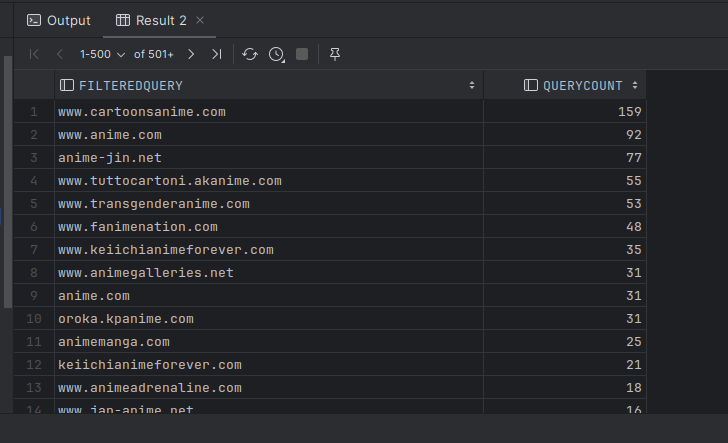
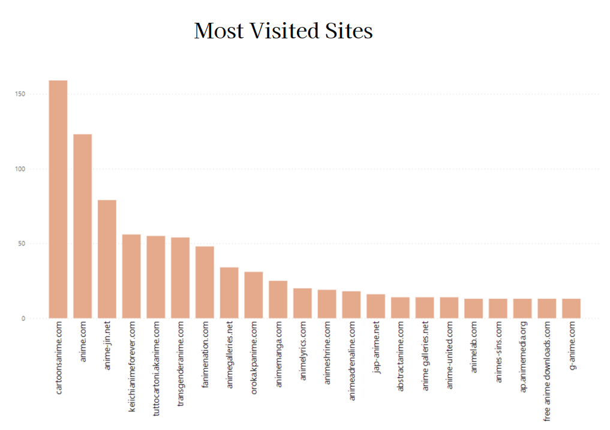
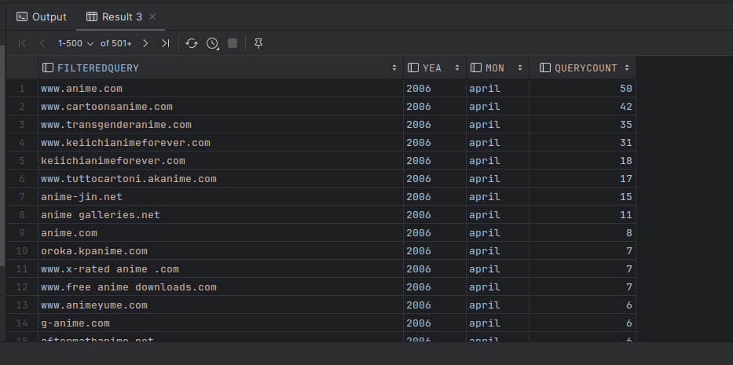
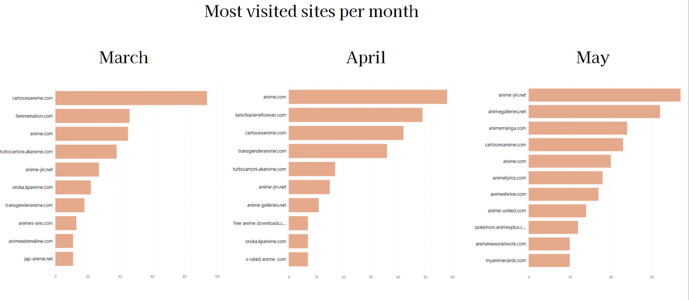

# Most visited websites overall

In this task, our primary objective is to analyze the most frequently visited websites by users. Initially, we merge tables based on specific columns as outlined in the schema to extract pertinent data. Recognizing that a substantial portion of the searches pertained to porn content, we opted to apply a filtering mechanism using the `NOT LIKE` command. This approach ensures that our analysis remains unbiased and does not skew towards a singular context. Subsequently, to narrow down our focus exclusively to websites, we utilized `POSITION` filtering to isolate instances containing a '.' symbol. The resultant filtered dataset was then visualized to generate the visualization presented below.

# Most visited websites in each month

Diving deeper into the analysis, our objective is to explore the most visited websites on a month-by-month basis. Utilizing the foundational code previously employed, we introduce the use of `COALESCE`. In this context, the COALESCE function serves to prioritize the filterquery where available; otherwise, it defaults to the total. By applying this function in our context, we aim to refine our dataset and examine the distribution across various months. Upon visualization, our findings reveal distinct website preferences across different months, emphasizing the temporal variability in user browsing patterns.

