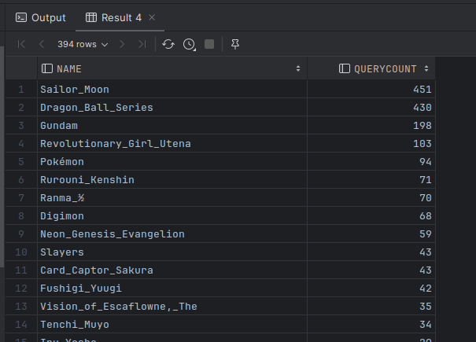

**(Refer file 2-1.sql and 2-2.sql)**

nitially, we extracted anime titles and their search counts from the DMOZ categories. Using advanced functions like `row_number()`, we organized this data by topic, joined relevant tables, and extracted associated state locations. It was crucial to filter out the initial two rows, which represented cumulative totals, so we utilized `rownumalias > 2` to exclude them.

**(Refer file 2-3.sql)**

However, due to Exasol 6's limitations in looping capabilities, we couldn't automate the process as initially planned. Instead, we manually input each anime title to obtain its relevant data, a method that was more time-consuming. Moving forward, utilizing a more advanced version of Exasol could streamline this procedure. To store this data, we created a `custom table` capturing details such as the anime title, its respective state location, and search count. To conclude, for visualization and analytical purposes, we exported this organized data as a CSV file and plotted using PowerBI.

