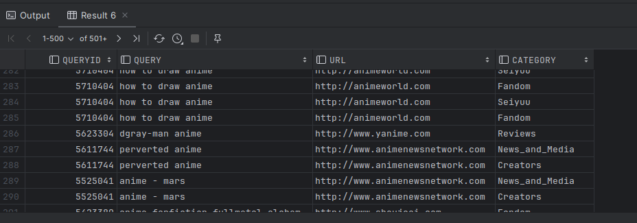
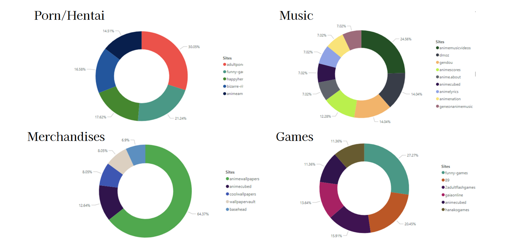

The code for this task is pretty simple. We mainly join specific columns in the table to gather our data. 

Additionally, we filter by `f.click = True` to see which links users have clicked/visited on. When it comes to plotting, we've adjusted the names of some categories to make them easier to understand and visualize.

**(Refer 3-1.sql)**

