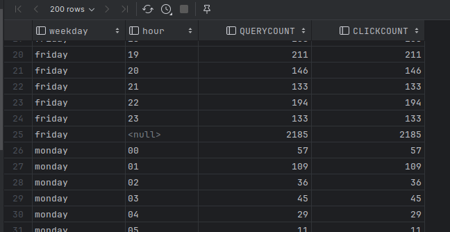
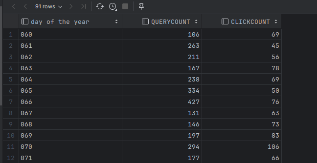
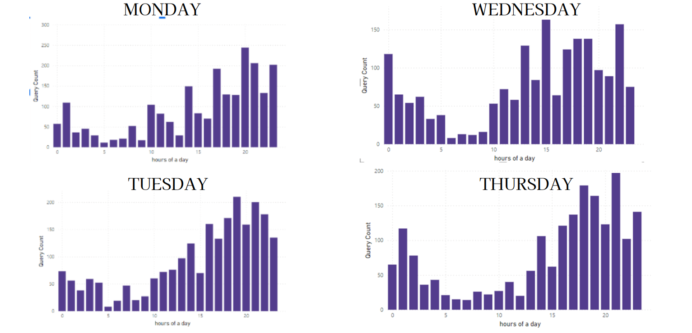
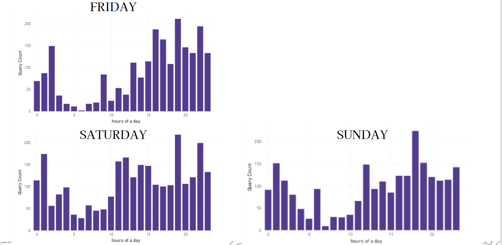
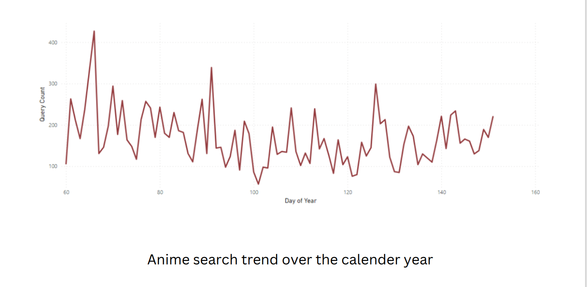

**(Refer file 4-1.sql and 4-2.sql)**

The code remains straightforward. Initially, we gather data on searches for each day of the week, using a cube function to aggregate by the weekdays and hours columns.

Subsequently, we shift our focus to an annual perspective, although the data is constrained to a three-month period from March. This timeframe spans from the 60th to the 150th day of the year.

From our visual plots, a clear trend emerges: peak search activity tends to occur in the evenings during weekdays. On an annual scale, the most heightened search activity occurs around the middle of the month, interspersed with noticeable rises and dips throughout the year.

