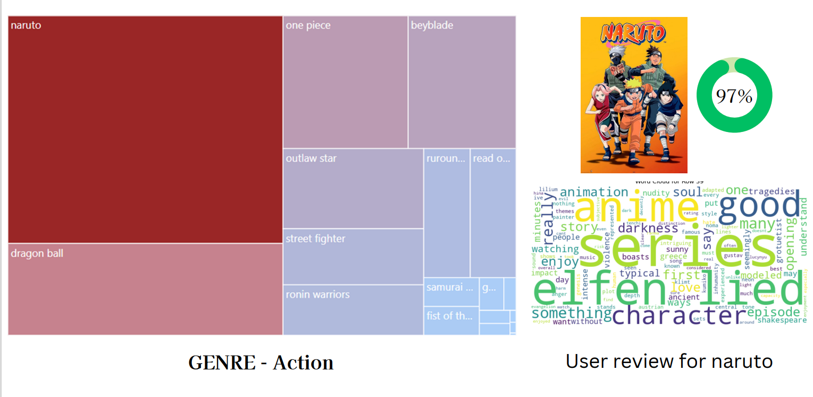
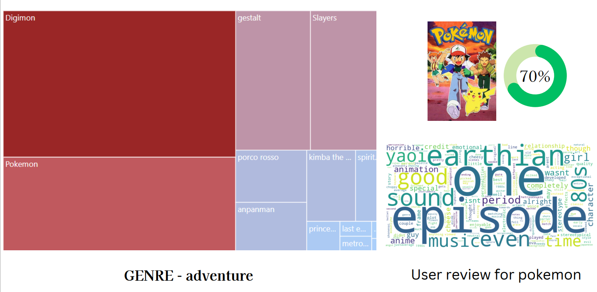

**(Refer 5.sql, 5-1.ipynb and wordcloud.ipynb file)**

Given that we lacked our own review data, we turned to external anime datasets available on Kaggle, as previously mentioned.

Specifically, we worked with two datasets: animes.csv, containing anime titles, and reviews.csv, which includes user review text. Using Python, we merged these datasets to combine anime titles with their respective reviews and popularity scores.

After merging, we refined the review text and standardized the anime titles to lowercase, ensuring compatibility with our imported clean dataset in DataGrip. This step ensured that our analysis focused solely on anime titles present in our data, offering a more accurate representation.

The process involved straightforward coding, where we employed a treemap to visualize popular anime within specific genres. Additionally, we utilized Python to create a word cloud, providing insights into user sentiment regarding the most popular anime in each genre.

